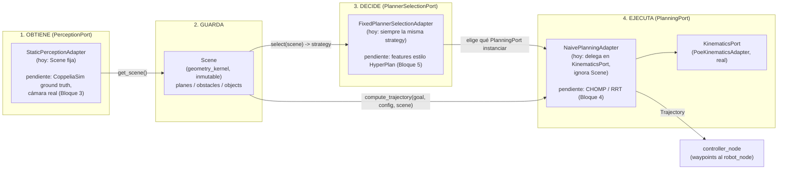

# Pipeline percepción → planificación: quién obtiene qué, cómo se guarda, quién decide

Complementa `docs/nodos_ros2.md` (contrato de nodos) centrándose en los tres
puertos que hoy están en distinto grado de esqueleto: `PerceptionPort`,
`PlanningPort`, `PlannerSelectionPort` (los tres en `shared_kernel/ports.py`).
Como el resto del repo, distingue **estado actual (implementado)** de
**diseño objetivo (pendiente, ver `ROADMAP.md`)**.

## 1. El flujo, de un vistazo



## 2. Cómo se obtiene la información — `PerceptionPort`

```python
class PerceptionPort(Protocol):
    def get_scene(self) -> Scene: ...
```

**Estado actual:** `StaticPerceptionAdapter` (`perception_node/adapters/`)
devuelve una `Scene` fija pasada en el constructor. No detecta nada — es el
mismo papel que `NaiveTestKinematicsAdapter` tuvo para `KinematicsPort`:
deja el puerto cableado con algo real que consumir.

**Diseño objetivo (Bloque 3, pendiente):** un adaptador que consulte la API
de la escena de CoppeliaSim (ground truth simulado, sin cámara) y, más
adelante, uno con visión real. Ninguno existe todavía — `perception_node`
no depende de `rclpy` porque no hay nada que publicar/suscribir hasta que
exista un productor real.

## 3. Cómo se guarda — `Scene`

`Scene` (`geometry_kernel/scene.py`) es el *único* lugar donde vive el
estado de la escena — nadie más lo cachea ni lo duplica. Es un value object
inmutable, igual que `JointConfiguration`/`Trajectory`:

```python
@dataclass(frozen=True)
class Scene:
    planes: Dict[str, Plane]
    obstacles: List[SphereObstacle]
    objects: Dict[str, Point]
```

Cada `with_plane`/`with_obstacle`/`with_object` devuelve una `Scene` nueva.
No hay una "escena viva" que se actualice en sitio — cada vez que
`PerceptionPort.get_scene()` se llama, devuelve la `Scene` completa vigente
en ese instante. Esto es deliberado: evita que `PlanningPort`/
`PlannerSelectionPort` tengan que preocuparse de sincronización o de leer
una escena a medio actualizar.

**Representación:** cartesiana (Point/Plane/SphereObstacle), no CGA real
todavía — ver `docs/algebra_geometrica_conforme.md` para el mapeo previsto
cuando `pygafro` esté disponible (Bloque 1). El día que eso pase, `Scene`
no cambia de forma pública: solo cambia lo que hay dentro de cada
primitiva.

## 4. Quién decide qué puerto usar — `PlannerSelectionPort`

```python
class PlannerSelectionPort(Protocol):
    def select(self, scene: Scene) -> str: ...
```

Devuelve un identificador de `strategy` — el mismo tipo de string que ya
consume `ControllerNode._build_adapter` para elegir entre
`"poe"`/`"ga"`/`"dh"`/`"naive_test"`/`"straight_line"`/`"coppeliasim_ik"`
(`controller_node/node.py`). La idea es que, cuando este puerto tenga una
implementación real, su salida alimente esa misma fábrica — no hace falta
un mecanismo de selección paralelo.

**Estado actual:** `FixedPlannerSelectionAdapter` recibe la `strategy` por
constructor y la devuelve siempre, sin mirar la `Scene` — cero lógica de
decisión real todavía.

**Diseño objetivo (Bloque 5, pendiente):** features de la escena al estilo
HyperPlan (ratio de espacio libre, nº de regiones-obstáculo, derivadas de
las primitivas CGA del Bloque 1) para elegir entre CHOMP/RRT/straight_line
según el estado real de la escena, no una constante.

## 5. Quién ejecuta con esa decisión — `PlanningPort`

```python
class PlanningPort(Protocol):
    def compute_trajectory(
        self, goal: Pose, current_configuration: JointConfiguration, scene: Scene
    ) -> Trajectory: ...
```

Es un superconjunto de `KinematicsPort`: mismo contrato de entrada/salida,
más la `Scene`. **Estado actual:** `NaivePlanningAdapter` envuelve
cualquier `KinematicsPort` (hoy, `PoeKinematicsAdapter`) e ignora la
`Scene` por completo — no evita ningún obstáculo, solo demuestra que el
puerto funciona de punta a punta.

**Diseño objetivo (Bloque 4, pendiente):** un adaptador CHOMP mínimo que sí
use la `Scene` (gradiente que evita las `SphereObstacle` recibidas), y RRT
como alternativa/baseline para comparar.

## 6. Lo que NO hace este esqueleto (a propósito)

- **No está wireado dentro de `controller_node`/`ControlSession` todavía.**
  `_build_adapter` sigue construyendo un `KinematicsPort` directamente vía
  el parámetro ROS2 `strategy` — no pasa por `PlannerSelectionPort` ni
  produce una `Scene` desde `PerceptionPort`. Conectar esto exige decidir
  *de dónde* sale la `Scene` en runtime (¿un topic nuevo? ¿una llamada
  directa desde `ControllerNode`?) — decisión de diseño real del Bloque 3,
  no algo que este esqueleto deba forzar todavía.
- **No hay ningún topic ROS2 nuevo.** Los tres adaptadores son clases
  Python puras, verificadas en `test/` y en una demo manual (ver commit)
  encadenando los tres puertos en un script — ninguno corre dentro de un
  nodo `rclpy` por ahora.
