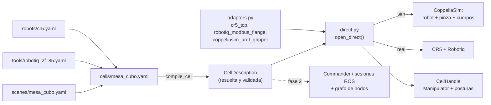

# Células y escenarios

Cómo se describe y se construye una **célula de trabajo** (robot +
herramientas + escena) sin escribir un script a medida para cada prueba.
Código: `src/commander/commander/cell/`. Descripciones:
`descriptions/` en la raíz del repo. Campos de cada formato:
[[Guía de formatos YAML]] (generada de los esquemas). Decisiones:
[[Decisiones de Diseño Clave]] (01/10, dos).

> [!success] Estado (01/10): formatos por elemento, verificados en CoppeliaSim
> `pick_place_demo --cell mesa_cubo --pick cubo --place destino`, ya con
> la célula compilada de sus cuatro piezas: coge el cubo (apertura 0,45,
> `holding_object` True) y lo deja en (−0,528, +0,259, +0,025), justo el
> punto pedido. Lo mismo que con la versión de un solo fichero. 222 tests.

## Por qué

Hasta el 01/10, de 22 demos de `commander` solo 9 usaban sesiones. El
resto montaba su mundo a mano. La causa no era desorden, sino que faltaban
cosas en el camino de [[Commander y ControlSession|Commander]]:
- `send_goal` publica y no espera: no se puede encadenar "cuando llegues,
  cierra la pinza";
- las sesiones no conocían la escena (cada demo la construía con
  `coppeliasim_scene_builder`);
- el pipeline no sabía de pinzas ni de tareas (`pick`/`place`).

## Tres clases de YAML

| Clase | Dónde | Qué describe | Sabe de ROS |
| --- | --- | --- | --- |
| Elementos del mundo | `descriptions/robots/`, `tools/`, `scenes/` | Un robot, una herramienta, una escena: uno por fichero, reutilizables | No |
| Composición (célula) | `descriptions/cells/` | Qué piezas se usan y cómo: destino sim/real, cinemática, posturas de la tarea | No (en el modo ROS, también qué nodos se lanzan) |
| Tipos de nodo | `src/<paquete>/config/<nodo>.yaml` | La interfaz de un nodo: parámetros, topics, timers (ya existían, `ros2_kit`) | Sí |



Una célula solo referencia:

```yaml
name: mesa_cubo
robot: {ref: cr5, target: sim, initial_posture: home}
tools: [{ref: robotiq_2f_85}]          # en real: grasp_offset MEDIDO
scene: {ref: mesa_cubo}
kinematics: poe
postures:
  pre_agarre: [0, 20, 100, -30, -90, 0]
```

Un `ref` es un nombre de `descriptions/<tipo>/` o una ruta relativa a la
célula. Las rutas dentro de un elemento (p. ej. el URDF) son relativas a
ese fichero o con `~`.

## Las piezas del código (`commander/cell/`)

- **`schema.py`**: cada sección de un formato declara sus campos UNA vez;
  de ahí salen la validación estricta (una clave mal escrita es un error
  con su sitio: `scenes/mesa_cubo.bodies.cubo: clave(s) desconocida(s)
  graspabel`) y la tabla de la [[Guía de formatos YAML]]. Un test falla si
  la guía se queda atrás.
- **`elements.py`**: robot y herramienta (antes un catálogo en Python).
  Los joints del robot se derivan del URDF si no se escriben.
- **`scene_format.py`**: la escena → `Scene` (cuerpos, puntos, obstáculos,
  planos).
- **`compile.py`**: `compile_cell(nombre)` resuelve las referencias,
  comprueba que los adaptadores nombrados existen y devuelve la
  `CellDescription`.
- **`description.py`**: la célula **resuelta**; valida las reglas entre
  piezas (la herramienta tiene montaje en ese robot, cada postura un valor
  por joint, el real tiene IP, sección `real` y `grasp_offset` medido; una
  postura de la tarea no puede reutilizar el nombre de una del robot).
- **`adapters.py`**: la única parte que es código por hardware: adaptadores
  por nombre. Hardware que solo cambia de medidas o de montaje = un YAML.
- **`direct.py`**: modo directo. `open_direct(cell)` construye la célula en
  este proceso y devuelve un `CellHandle` con el `Manipulator`
  (`commander/manipulation.py`), las posturas y, en simulación, una vista
  para comprobar dónde ha quedado cada cuerpo. En real no mueve nada al
  abrir; al salir cierra la pinza y des-energiza, también si algo falla.
- **`node_format.py`**: esquema de los tipos de nodo, para la guía y para
  el grafo (siguiente paso).
- **`guide.py`**: genera la guía (`ros2 run commander cell_guide --write`).

## Uso

```bash
ros2 run commander cell_demo --cell mesa_cubo --posture pre_agarre
ros2 run commander pick_place_demo --cell mesa_cubo --pick cubo --place destino
# mismo script contra el robot real (con una célula medida):
ros2 run commander pick_place_demo --cell mi_celda --pick cubo --place destino \
    --target real --host 192.168.5.1
```

## Fases

1. **Hecha (01/10):** descripción + modo directo; sustituye a
   `workcells.py` y a las demos `cr5_objects_sim_demo` /
   `cr5_pick_place_sim_demo` (ahora `cell_demo` y `pick_place_demo`).
   El mismo día, separada en un formato por elemento con guía generada.
2. `Commander`/`ControlSession` construidos desde la descripción, en vez
   de 15 parámetros sueltos: la célula declara las instancias de nodo y
   compilarla da el **grafo de nodos**, que comprueba suscripciones sin
   publicador (salvo entradas declaradas), tipos y QoS incompatibles y
   nombres duplicados, y sale como diagrama Mermaid. `Commander` declara su
   propia interfaz para estar en el grafo. Monta el mundo simulado;
   `robot_node` gana la pinza de simulación y publica `gripper_state`.
3. Adaptadores de los puertos que hablan por ROS y **acciones** con
   resultado: el mismo `Manipulator` funciona sobre ROS. `pick`/`place`
   como acciones: son las "tools" del Bloque 6.
4. Migrar o retirar las demos antiguas y ordenar el paquete (`sim/`,
   `demos/`).

## Deuda conocida

- `manipulation.py` y `cell/` viven en `commander`: son lógica de
  aplicación, no del cliente ROS. Moverlos es trivial (solo dependen de
  puertos).
- `_wait_until_robot_idle` sigue copiado en 4 demos (`cr5_circle_demo`,
  `cr5_semicircle_demo`, `cr5_wave_demo`, `poe_sim_then_real_demo`);
  la versión buena es `Cr5RealRobotAdapter.wait_until_idle` (01/10).
- `grasp_offset` es un TCP disfrazado: debería ser un frame de
  herramienta en [[KinematicsPort]], no una compensación en
  `Manipulator`.
- `pick` conserva la orientación actual: no hay planificador de agarres.
- El URDF del CR5 está fuera del repo (`~/ros2_ws/...`): una célula con el
  CR5 no compila en una máquina sin ese workspace (los tests que lo
  necesitan se saltan).

## Ver también

- [[Guía de formatos YAML]] — todos los campos, generada
- [[Commander y ControlSession]]
- [[Scene y Percepción]] — `Scene.bodies`
- [[CoppeliaSimGripperAdapter]] — el agarre cinemático
- [[Herramientas de CoppeliaSim]]
