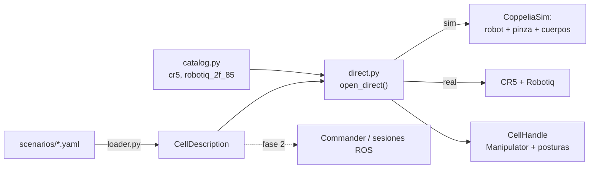

# Células y escenarios

Cómo se describe y se construye una **célula de trabajo** (robot +
herramientas + escena) sin escribir un script a medida para cada prueba.
Código: `src/commander/commander/cell/`. Escenarios:
`scenarios/*.yaml` en la raíz del repo. Decisión de diseño:
[[Decisiones de Diseño Clave]] (01/10).

> [!success] Estado (01/10): fase 1 hecha y verificada en CoppeliaSim
> `pick_place_demo --scenario mesa_cubo --pick cubo --place destino`:
> cogió el cubo (apertura 0,45, `holding_object` True) y lo dejó en
> (−0,528, +0,259, +0,025), justo el punto pedido, apoyado en la mesa.
> 213 tests en verde.

## Por qué

Hasta el 01/10, de 22 demos de `commander` solo 9 usaban sesiones. El
resto montaba su mundo a mano. La causa no era desorden, sino que faltaban
cosas en el camino de [[Commander y ControlSession|Commander]]:
- `send_goal` publica y no espera: no se puede encadenar "cuando llegues,
  cierra la pinza";
- las sesiones no conocían la escena (cada demo la construía con
  `coppeliasim_scene_builder`);
- el pipeline no sabía de pinzas ni de tareas (`pick`/`place`).

## Las piezas



- **`CellDescription`** (`description.py`): robot (`model`, `target`
  sim/real, `host`, `initial_posture`), herramientas (`model`,
  `grasp_offset`), cinemática (`poe`/`ga`), simulador, **posturas con
  nombre** (grados) y la `Scene` inicial. Solo datos y validación: no
  sabe qué es CoppeliaSim. Reglas: el real exige `host` y `grasp_offset`
  **medido**; una sola herramienta por ahora.
- **Catálogo** (`catalog.py`): qué significa cada nombre del YAML
  (`cr5`: su URDF, joints, tip; `robotiq_2f_85`: dónde se monta en cada
  robot y cómo se crea su adaptador en sim y en real). Robot o
  herramienta nueva = entrada nueva aquí.
- **Lector** (`loader.py`): YAML → `CellDescription`. **Estricto**: una
  clave desconocida es un error que dice dónde está
  (`scene.bodies.cubo: clave(s) desconocida(s) graspabel`), no algo que
  se ignora en silencio.
- **Modo directo** (`direct.py`): `open_direct(cell)` construye la célula
  en este proceso y devuelve un `CellHandle` con el `Manipulator`
  (`commander/manipulation.py`), las posturas y, en simulación, una vista
  para comprobar dónde ha quedado cada cuerpo. En real no mueve nada al
  abrir; al salir cierra la pinza y des-energiza, también si algo falla.
  La cinemática se construye **del URDF** del modelo (verificado en seco:
  mismos resultados que el CR5 fijo de PoE).

## El formato

```yaml
name: mesa_cubo
robot: {model: cr5, target: sim, initial_posture: home}
tools:
  - model: robotiq_2f_85      # grasp_offset: obligatorio (medido) en real
kinematics: poe
postures:
  pre_agarre: [0, 20, 100, -30, -90, 0]
scene:
  bodies:
    cubo: {shape: box, size: [0.05, 0.05, 0.05],
           position: [-0.571, -0.141, 0.025], graspable: true}
  points:
    destino: [-0.528, 0.259, 0.025]
```

Formas `box`/`cylinder`/`sphere`, orientación con `rpy_degrees`
(convención URDF) o `quaternion`. También `scene.obstacles` y
`scene.planes`. Referencia completa en el docstring de `loader.py`.

## Uso

```bash
ros2 run commander cell_demo --scenario mesa_cubo --posture pre_agarre
ros2 run commander pick_place_demo --scenario mesa_cubo --pick cubo --place destino
# mismo script contra el robot real (con un escenario medido):
ros2 run commander pick_place_demo --scenario mi_celda --pick cubo --place destino \
    --target real --host 192.168.5.1
```

## Fases

1. **Hecha (01/10):** `CellDescription` + YAML + modo directo; sustituye a
   `workcells.py` y a las demos `cr5_objects_sim_demo` /
   `cr5_pick_place_sim_demo` (ahora `cell_demo` y `pick_place_demo`).
2. `Commander`/`ControlSession` reciben la descripción en vez de 15
   parámetros sueltos; el montaje del mundo simulado pasa a `Commander`;
   `robot_node` gana la pinza de simulación y publica `gripper_state`.
3. Adaptadores de los puertos que hablan por ROS (un `RobotConnectorPort`
   y un `GripperPort` que hablan con `robot_node`) y **acciones** con
   resultado: el mismo `Manipulator` funciona sobre ROS. `pick`/`place`
   como acciones: son las "tools" del Bloque 6.
4. Migrar o retirar las demos antiguas y ordenar el paquete (`sim/`,
   `demos/`).

## Deuda conocida

- `manipulation.py` y `cell/` viven en `commander`: son lógica de
  aplicación, no del cliente ROS. Moverlos es trivial (solo dependen de
  puertos).
- `_wait_until_robot_idle` sigue copiado en 4 demos (`cr5_circle_demo`,
  `cr5_semicircle_demo`, `cr5_wave_demo`, `poe_sim_then_real_demo`);
  la versión buena es `Cr5RealRobotAdapter.wait_until_idle` (01/10).
- `grasp_offset` es un TCP disfrazado: debería ser un frame de
  herramienta en [[KinematicsPort]], no una compensación en
  `Manipulator`.
- `pick` conserva la orientación actual: no hay planificador de agarres.

## Ver también

- [[Commander y ControlSession]]
- [[Scene y Percepción]] — `Scene.bodies`
- [[CoppeliaSimGripperAdapter]] — el agarre cinemático
- [[Herramientas de CoppeliaSim]]
