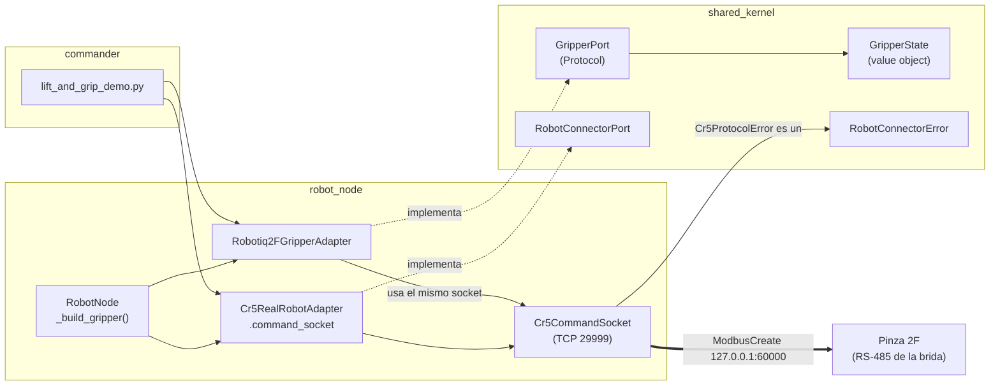

# Integración de la pinza en el repositorio

Cómo entró la **pinza Robotiq 2F** en la arquitectura hexagonal: qué
piezas se añadieron, qué se tocó de lo que ya había y cómo se conecta
todo. Para **usar** la pinza, ver [[Pinza Robotiq 2F - Uso práctico]].

> [!info] En git desde el 29/09
> Todo lo de abajo entró en el commit "Pinza Robotiq 2F: GripperPort +
> adaptador por el 485 de la brida…" (`2e387cb`), ya en `main`. La pinza
> en simulación (30/09) entró en un commit posterior, también en `main`.

## Idea de diseño

La pinza **no** se metió dentro de [[RobotConnectorPort]]. Tiene un
puerto propio, [[GripperPort]], por dos motivos:

- Agarrar no es mover articulaciones.
- Hay robots sin pinza, y el puerto del robot tiene que servir para
  cualquiera.

Lo que sí comparte con el robot es la **conexión**. La Robotiq cuelga
del RS-485 de la brida, y quien habla con ella es el controlador del
CR5, al que se llega por el puerto TCP 29999. Ese puerto **admite un
solo cliente**, así que el adaptador de la pinza no abre su conexión:
usa la de [[Cr5RealRobotAdapter]].



## Piezas nuevas

| Fichero | Qué es |
| --- | --- |
| `src/shared_kernel/shared_kernel/ports.py` → **`GripperPort`** | Puerto nuevo: `activate()`, `set_opening(fraction)`, `get_state()`, `close()`. Ver [[GripperPort]] |
| `src/shared_kernel/shared_kernel/value_objects.py` → **`GripperState`** | Foto del estado: `opening` (0 abierta … 1 cerrada), `activated`, `holding_object`, `fault_code` |
| `src/robot_node/robot_node/adapters/robotiq_2f_adapter.py` → **`Robotiq2FGripperAdapter`** | Implementa `GripperPort` para la Robotiq 2F a través del controlador del CR5. Ver [[Robotiq2FGripperAdapter]] |
| `src/robot_node/test/test_robotiq_2f_adapter.py` | 19 tests contra un socket de mentira (`FakeCommandSocket`) |
| `src/commander/commander/lift_and_grip_demo.py` | Primera secuencia brazo + pinza: sube el TCP y abre/cierra la pinza. Ver [[Scripts de Demostración]] |
| `docs/cr5_485_scope_test.py` | Laboratorio: lecturas repetidas por el 485 (`--via brida\|rtu`), para osciloscopio |
| `docs/cr5_controller485_probe.py` | Laboratorio: sondeo por el 485 del armario (`ModbusRTUCreate`) |
| `docs/robotiq_usb485_probe.py` | Laboratorio: habla con la pinza por un USB-485, sin el robot |

## Piezas existentes que se tocaron

| Fichero | Cambio |
| --- | --- |
| `shared_kernel/__init__.py` | Exporta `GripperPort` y `GripperState` |
| `robot_node/adapters/cr5_real_adapter.py` | Propiedad **`command_socket`**: expone el `Cr5CommandSocket` para que otro adaptador hable por él. No es parte de `RobotConnectorPort`; es un detalle de este adaptador, como `mark_goal` en [[CoppeliaSimRobotAdapter]] |
| `robot_node/node.py` | `_build_gripper()`, callbacks `_on_gripper_activate` / `_on_gripper_command`, y cierre de la pinza antes que el robot. Ver [[RobotNode]] |
| `robot_node/config/robot_node.yaml` | Parámetro `gripper_target` (`ninguna` por defecto, o `robotiq_2f`) y dos suscripciones: `gripper_activate` (`std_msgs/Empty`) y `gripper_command` (`std_msgs/Float64`) |
| `commander/setup.py` | Entrada `lift_and_grip_demo` |

`_cr5_protocol.py` **no se tocó**: la pinza solo usa `Cr5CommandSocket.query()`
tal como estaba.

## Cómo se conecta con lo que ya había

**1. Errores.** `GripperPort` no tiene excepción propia: sus fallos son
`RobotConnectorError`. `Cr5ProtocolError` ya heredaba de él, así que
`robot_node` captura los fallos de la pinza con el mismo `except` que
los del robot.

**2. Configuración.** Sigue el mismo camino que cualquier parámetro
([[Anatomía de un Nodo]]): YAML → `node_config.py` → `RobotNode`.
Con `gripper_target: ninguna` el nodo queda exactamente como estaba.
`robotiq_2f` exige `robot_target: real`, y si no se cumple el nodo
**falla al arrancar**, no en la primera orden: `_build_gripper()` busca
`command_socket` en el adaptador del robot.

**2b. Sin pinza o con la pinza ausente.** Con `gripper_target: ninguna`
no se crea el adaptador y no se envía nada; los topics existen, pero una
orden solo produce un aviso en el log. Con `robotiq_2f` y la pinza
desconectada, el nodo arranca bien (el adaptador no habla hasta la
primera orden); el primer `-1` marca la pinza como no disponible y las
órdenes siguientes se rechazan sin ocupar el socket del brazo. Ver
[[Robotiq2FGripperAdapter]].

**3. Topics.** `gripper_activate` va aparte de `gripper_command` a
propósito: activar mueve los dedos de tope a tope, y no debe poder
colarse dentro de un "cierra un poco".

**4. Cierre.** En `destroy_node()`, `RobotNode` cierra primero la pinza
(`ModbusClose` de su maestro) y después el robot (que cierra el socket).
Cada cierre va en su propio `try`: si falla el de la pinza, se loggea y
el robot se cierra igual.

**5. Secuencias fuera de ROS.** `lift_and_grip_demo.py` sigue el patrón
de las demos de `commander`: compone los adaptadores en Python, sin
`ControlSession`. Reutiliza las funciones de `poe_lift_and_wrist_demo.py`
(leer la postura real, trayectoria PoE, esperar a `RobotMode()==5`). La
espera es obligatoria: `MovJ` solo encola el movimiento, y sin ella la
pinza se movería con el brazo aún en marcha.

## Qué hace el adaptador por dentro

```
_ensure_master()  (una vez, al primer uso)
    SetToolMode(1)                       pines 1-2 en modo 485
    SetTool485(115200,"N",1)             formato serie de la brida
    ModbusCreate("127.0.0.1",60000,9,1)  maestro → índice guardado

activate()        lee el estado; si ya está activada y sin fallo grave, NADA
                  si no: SetHoldRegs 1000 {0,0,0} y luego {256,0,0}
set_opening(f)    SetHoldRegs 1000 {2304, round(f·255), vel·256+fuerza}
get_state()       GetHoldRegs 2000 → GripperState
close()           ModbusClose(índice)
```

No enciende la brida (`SetToolPower`): esa orden corta la conexión
TCP, así que se deja fuera del adaptador.

## Qué está verificado

| Qué | Cómo | Estado |
| --- | --- | --- |
| Empaquetado de registros y comandos | 19 tests del adaptador | ✅ |
| Leer, activar, abrir y cerrar | Scripts de `docs/` contra la pinza real | ✅ 29/09 |
| El **adaptador** contra la pinza real, compartiendo socket con el brazo | `lift_and_grip_demo --phase real` | ✅ 29/09: +49,9 mm, pinza 0,01 → 0,90 |
| El camino ROS (`robot_node` + topics) | Nodo real con `gripper_target:=robotiq_2f`, órdenes por topics | ✅ 29/09: 0.0 → 1.0 → 0.5, leído 0,502 |
| El nodo sin pinza no cambia | Nodo real con `gripper_target` por defecto | ✅ 29/09: solo avisos "ignorado" |
| `gripper_state` publicado | — | ⏳ no existe todavía |
| Pinza en simulación | `cr5_gripper_sim_demo` y `lift_and_grip_demo --phase sim`, con [[CoppeliaSimGripperAdapter]] | ✅ 30/09: pinza montada en la brida, abre/cierra y gira con la muñeca |
| Coger y dejar un cuerpo en simulación (agarre cinemático) | `pick_place_demo --scenario mesa_cubo`, ver [[Células y Escenarios]] | ⏳ en seco con PoE sí; en CoppeliaSim todavía no |

## Historia corta

- **17/09**: se identifica el modelo. Se sondea con `ModbusRTUCreate` y
  la pinza no contesta.
- **18/09**: `GripperPort`, `GripperState`, adaptador, tests y
  cableado en `robot_node`, todo sin poder probarlo.
- **18/09-24/09**: se descartan cable, orden de configuración y
  parámetros; siempre `-1`. Ver [[E-S del Extremo del CR5 (pinza)]].
- **29/09**: el ejemplo oficial de Dobot+ muestra la vía buena
  (`ModbusCreate` por el 60000). La pinza contesta; el adaptador se
  cambia a esa vía y se ajusta según el SDK oficial de Robotiq
  (`activate()` no reactiva; `gFLT` solo bits 0-3). Primera secuencia
  brazo + pinza.
- **30/09**: pinza en simulación. URDF oficial de la 2F-85 copiado a
  `assets/robotiq_2f_85/`, montado en la brida del CR5 por
  `coppeliasim_scene_builder` (`ToolMount`) y movido con
  [[CoppeliaSimGripperAdapter]]. Un URDF por pieza, no uno combinado:
  ver [[Decisiones de Diseño Clave]].

## Pendiente

- Publicar `gripper_state` (hoy, desde ROS no se sabe si agarró algo).
- Decidir si `opening` se normaliza a los topes reales (3-228 de 255).
- Un adaptador de simulación para CoppeliaSim (sustituiría el `if` de
  `_build_gripper()` por un registro como `_TARGETS`).

## Ver también

- [[GripperPort]] · [[Robotiq2FGripperAdapter]]
- [[Pinza Robotiq 2F - Uso práctico]] · [[Manejar la pinza Robotiq 2F]] · [[E-S del Extremo del CR5 (pinza)]]
- [[Puertos y Adaptadores]] · [[RobotNode]] · [[Cr5RealRobotAdapter]]
