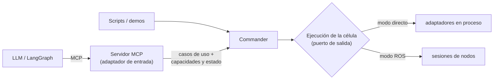

# Roles del Commander

Qué hace `Commander` y qué no, ahora que va a ser la base de la API para el
LLM (Bloque 6). Decisión del 01/10 en [[Decisiones de Diseño Clave]].

## Lo que ya estaba fijado

- El mecanismo para el LLM es **MCP** (propuesta de tesis, A.3).
- El LLM **nunca escribe código**: encadena operaciones ya validadas del
  repo (nota de diseño del Régimen 1, ROADMAP).
- `Commander` no sabe que existen CoppeliaSim, PoE ni el CR5, ni cómo se
  despliega cada nodo (Bloque 8).
- F1.7 (tesis): un grafo LangGraph acota qué tools hay según el estado.

## Decisión (01/10)

`Commander` es el **núcleo de aplicación**; el servidor MCP es un
**adaptador de entrada** más, como los scripts. Los dos modos de ejecución
(directo y ROS) son dos implementaciones de un mismo puerto de salida.

| Rol | Prioridad | Qué hace |
| --- | --- | --- |
| **Gestor de células** | **Ahora** | Crear células válidas (compilar la descripción, validar el grafo de nodos), abrirlas, cerrarlas, listarlas. Un solo `Commander` para varias células. |
| **Modelo del mundo** | **Ahora** | Crear el mundo de una célula (su escena inicial) y mantenerlo al día: lo que llega de percepción, lo que cambian las propias acciones (coger, dejar), estado del brazo y de la pinza. Una sola fuente de verdad que consultar. |
| **Capacidades** | **Ahora** | Qué se puede hacer en una célula y en su estado actual. El servidor MCP lo consulta al crear o cambiar una célula y actualiza sus tools (`tools/list_changed`). |
| Ejecutor de habilidades | Después | `move_to`, `pick`, `place`... con resultado; las tools largas esperan a terminar (con límite) y hay tools de estado y cancelar. |
| Guardián (verify-then-act, F1.6) | Después | Comprobar antes de ejecutar (IK, límites, colisiones) y la confirmación humana en el real. |

## Estado (01/10): gestor, mundo y capacidades hechos, en modo directo

Verificado en CoppeliaSim con `mesa_cubo` (script de comprobación, sin
demo nueva): al abrir, el mundo toma del simulador la pose exacta del cubo
y se ofrece `pick` con `cubo | lata`; tras `pick` desaparecen `pick` y
`close_gripper` y aparece `place`; tras `place` el cubo está en el destino
con origen `accion`; `refresh_world` lo confirma con origen `simulador`.
258 tests.

- **`commander/cell_manager.py` → `CellManager`**: `create_cell` (de un
  nombre, una ruta, un dict o una `CellDescription`; si no es válida, el
  error dice dónde), `open_cell`, `close_cell`, `list_cells`,
  `refresh_world`, `describe` (solo tipos JSON, para MCP) y `subscribe`
  (eventos `created`, `opened`, `closed`, `world`). Recibe cómo abrir una
  célula (`open_runtime`): hoy `open_direct`; en la fase 2, sesiones ROS.
  Se llama así para no confundirlo con el nodo ROS `Commander`, que le
  delegará. `pick` y `place` son las primeras habilidades, sobre todo para
  que el mundo se entere de sus efectos.
- **`commander/world.py` → `World`**: ver la regla abajo.
- **`cell/capabilities.py`** y las declaraciones en `cell/adapters.py`.

### El mundo: regla de confianza

Orden `simulador > percepción > acción > escena inicial`, con una regla
más: **nuestras propias acciones invalidan lo visto antes** (cambian el
mundo). Un dato se acepta si no es más antiguo que el que hay y su fuente
tiene igual o más rango, o es una acción. Así la percepción posterior a un
`place` corrige lo esperado, y en simulación la percepción nunca pisa al
simulador. Cada cuerpo guarda su origen y su momento (`describe` da la
antigüedad en segundos). El estado del brazo y de la pinza viene del
propio hardware (o del simulador) y no compite con nada.

### Las tools y el cliente manual (01/10)

Antes del LLM, control manual viendo exactamente lo que vería el LLM:

- **`commander/tools.py` → `ToolBox`**: `list_tools()` da las tools
  disponibles AHORA en el formato de MCP (`name`, `description`,
  `inputSchema` con las opciones como `enum`); `call(nombre, args)`
  devuelve siempre JSON, también los errores (`{"ok": false, "error":
  ...}`), para que un LLM pueda leerlos y corregirse. Dos niveles:
  configuración (`list_cells`, `create_cell`, `open_cell`, `close_cell`,
  `select_cell`) y operación sobre la **célula activa** (`get_world` y las
  operaciones de `describe`). El servidor MCP será una capa fina encima.
- **`CellManager.execute`**: ejecuta cualquier operación anunciada,
  comprobando antes que está disponible ahora y que cada argumento es una
  opción ofrecida. Todas tienen ejecutor: `move_to_posture`,
  `move_above_point` (nuevo `Manipulator.move_above`), `open_gripper`,
  `close_gripper` (en sim, cerrar sobre un cuerpo lo coge), `pick`,
  `place`, `refresh_world`, `reset_cell` (cierra y reabre: escena
  reconstruida).
- **`ros2 run commander cell_console [--cell mesa_cubo --open]`**: enseña
  las tools numeradas, pide las opciones, enseña el JSON del resultado y,
  tras cada llamada, qué tools han aparecido o desaparecido (lo que MCP
  notificará con `tools/list_changed`). `j` enseña el JSON de las tools tal
  cual. La línea de estado de arriba es solo para la persona.

Verificado en CoppeliaSim con la consola (entrada por guion): postura,
`pick` (aparece `place`, desaparecen `pick` y `close_gripper`), `place`,
encima de un punto, cerrar y abrir en vacío, un `pick` de la mesa que
vuelve como error con las opciones válidas, `reset_cell` (el cubo vuelve
a su sitio, confirmado por el simulador) y `get_world`.

### Limitaciones conocidas

- Mientras se sujeta un cuerpo, el mundo conserva su última pose conocida
  (viaja con la pinza). `refresh_world` en simulación la actualiza.
- Todavía no hay percepción conectada al mundo ni modo ROS.
- Las tools son síncronas: una tool larga bloquea hasta terminar (sin
  cancelar todavía).

## Capacidades: de dónde salen

1. Cada adaptador del registro (`cell/adapters.py`) declara qué ofrece —
   brazo real o simulado, pinza, detección de agarre, verdad del simulador,
   percepción — junto a su código, porque es una propiedad de la
   implementación.
2. Compilar la célula da su conjunto de capacidades (sin pinza no hay
   `pick`; solo en simulación hay reiniciar la escena o leer la posición
   exacta de un cuerpo).
3. El estado del mundo las acota en cada momento (sujetando algo: `place`
   sí, `pick` no).
4. Los parámetros de las tools salen del mundo: `pick` recibe uno de los
   cuerpos agarrables, `move_joints` una de las posturas con nombre. El LLM
   elige entre opciones que existen (grounding, Bloque 3).

## Dos niveles de API

- **Configuración** (el Régimen 1 original, "descripción → nodo
  validado"): consultar el catálogo, escribir una célula y validarla,
  abrirla. Los formatos de [[Guía de formatos YAML]] son el lenguaje de
  este nivel.
- **Operación**: actuar sobre una célula abierta y consultar su mundo.

## Ver también

- [[Células y Escenarios]] — la descripción de la célula y sus fases
- [[Commander y ControlSession]] — lo que hay hoy
- [[Scene y Percepción]]
