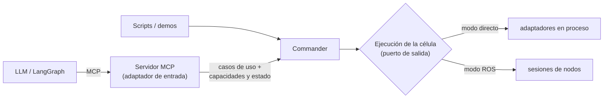

# Roles del Commander

Qué hace `Commander` y qué no, ahora que va a ser la base de la API para el
LLM (Bloque 6). Decisión del 01/10 en [[Decisiones de Diseño Clave]].

## Lo que ya estaba fijado

- El mecanismo para el LLM es **MCP** (propuesta de tesis, A.3).
- El LLM **nunca escribe código**: encadena operaciones ya validadas del
  repo (nota de diseño del Régimen 1, ROADMAP).
- `Commander` no sabe que existen CoppeliaSim, PoE ni el CR5, ni cómo se
  despliega cada nodo (Bloque 8).
- F1.7 (tesis): un grafo LangGraph acota qué tools hay según el estado.

## Decisión (01/10)

`Commander` es el **núcleo de aplicación**; el servidor MCP es un
**adaptador de entrada** más, como los scripts. Los dos modos de ejecución
(directo y ROS) son dos implementaciones de un mismo puerto de salida.

| Rol | Prioridad | Qué hace |
| --- | --- | --- |
| **Gestor de células** | **Ahora** | Crear células válidas (compilar la descripción, validar el grafo de nodos), abrirlas, cerrarlas, listarlas. Un solo `Commander` para varias células. |
| **Modelo del mundo** | **Ahora** | Crear el mundo de una célula (su escena inicial) y mantenerlo al día: lo que llega de percepción, lo que cambian las propias acciones (coger, dejar), estado del brazo y de la pinza. Una sola fuente de verdad que consultar. |
| **Capacidades** | **Ahora** | Qué se puede hacer en una célula y en su estado actual. El servidor MCP lo consulta al crear o cambiar una célula y actualiza sus tools (`tools/list_changed`). |
| Ejecutor de habilidades | Después | `move_to`, `pick`, `place`... con resultado; las tools largas esperan a terminar (con límite) y hay tools de estado y cancelar. |
| Guardián (verify-then-act, F1.6) | Después | Comprobar antes de ejecutar (IK, límites, colisiones) y la confirmación humana en el real. |

## Capacidades: de dónde salen

1. Cada adaptador del registro (`cell/adapters.py`) declara qué ofrece —
   brazo real o simulado, pinza, detección de agarre, verdad del simulador,
   percepción — junto a su código, porque es una propiedad de la
   implementación.
2. Compilar la célula da su conjunto de capacidades (sin pinza no hay
   `pick`; solo en simulación hay reiniciar la escena o leer la posición
   exacta de un cuerpo).
3. El estado del mundo las acota en cada momento (sujetando algo: `place`
   sí, `pick` no).
4. Los parámetros de las tools salen del mundo: `pick` recibe uno de los
   cuerpos agarrables, `move_joints` una de las posturas con nombre. El LLM
   elige entre opciones que existen (grounding, Bloque 3).

## Dos niveles de API

- **Configuración** (el Régimen 1 original, "descripción → nodo
  validado"): consultar el catálogo, escribir una célula y validarla,
  abrirla. Los formatos de [[Guía de formatos YAML]] son el lenguaje de
  este nivel.
- **Operación**: actuar sobre una célula abierta y consultar su mundo.

## Ver también

- [[Células y Escenarios]] — la descripción de la célula y sus fases
- [[Commander y ControlSession]] — lo que hay hoy
- [[Scene y Percepción]]
